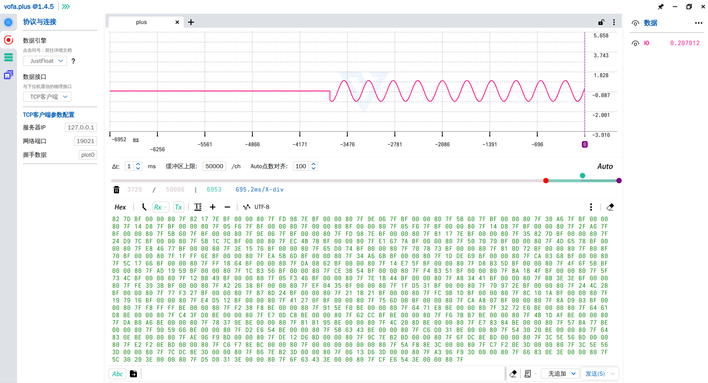

# J-Link RTT S32K3 数据可视化示例

本项目演示了如何利用 SEGGER J-Link 的 RTT（Real Time Transfer）技术，从 NXP S32K3 系列微控制器实时导出数据，并使用 VOFA+ 上位机软件进行图形化展示。

## 项目组成

- **SEGGER_RTT 核心文件**:
    - [SEGGER_RTT.c](SEGGER_RTT.c) / [SEGGER_RTT.h](SEGGER_RTT.h): 从 SEGGER 官方库移植并针对 S32K3 进行了精简，仅保留了必要的初始化和二进制数据发送功能。
    - [SEGGER_RTT_Conf.h](SEGGER_RTT_Conf.h): RTT 配置头文件。
- **[main.c](main.c)**: S32K314 端的示例代码。
    - 在循环中计算 `sin` 函数值。
    - 使用 `SEGGER_RTT_Write` 将数据（float 数组）写入 RTT 缓冲区。
    - 为了配合 VOFA+ 的 `JustFloat` 协议，数据包中包含了一个特殊的结束符（Infinity）。
- **[start.py](start.py)**: 主机端 Python 辅助脚本。
    - 负责连接本地 19021 端口（J-Link RTT TELNET 端口）。
    - 发送符合 SEGGER 协议的控制命令字 `$$SEGGER_TELNET_ConfigStr=...$$`，用于告知调试器 RTT 控制块（CB）的内存地址。
- **VOFA+**: 第三方数据可视化软件，用于接收并绘制波形。

## 工作原理

1.  **RTT 机制**: RTT 是 SEGGER 推出的一种在嵌入式目标和主机之间进行高速数据传输的技术。它通过调试接口（如 SWD/JTAG）直接读写内存中的环形缓冲区，不占用目标 CPU 的串口等外设。
2.  **数据流向**:
    - **S32K3**: 运行 `main.c`，将计算好的波形数据写入指定的 RTT 缓冲区。
    - **J-Link GDB Server**: 在 S32DS 调试过程中，GDB Server 会监听本地 TCP 19021 端口。
    - **start.py**: 脚本连接 19021 端口并发送配置字符串（包含 `SetRTTAddr` 命令）。这一步非常关键，因为它显式指定了 RTT 控制块在 S32K3 内存中的地址，确保调试器能正确找到数据。程序中使用的地址是0，即为自动寻找Control Block的地址。这个地址被写在VTOR寄存器所指地址 + 32字节的位置上，中断向量表的第8个入口，该地址的最低bit需要+1。运行完以后，再次连接该端口，即可接收数据。
    - **VOFA+**: 选择 `JustFloat` 协议，连接到 19021 端口，接收来自 J-Link 的原始数据流并解析成波形。

## 使用步骤

1.  **编译与调试**: 使用 S32DS 编译 [main.c](main.c) 并启动调试（Debug）。确保 J-Link GDB Server 正在运行。
2.  **触发 RTT**: 运行 [start.py](start.py) 脚本。
    ```bash
    python3 start.py
    ```
3.  **可视化展示**:
    - 打开 [VOFA+](https://www.vofa.plus/)。
    - 在设置中选择 `TCP Client` 连接 `127.0.0.1:19021`。
    - 协议选择 `JustFloat`。
    - 即可看到实时的正弦波形输出。

    

## 相关资源

- **SEGGER RTT 官方仓库**: [https://github.com/SEGGERMicro/RTT](https://github.com/SEGGERMicro/RTT) - 包含了 RTT 的核心源码及各种平台的示例。
- **J-Link RTT Telnet 协议说明**: [https://kb.segger.com/J-Link_RTT_TELNET_Channel](https://kb.segger.com/J-Link_RTT_TELNET_Channel) - 详细介绍了如何通过 TCP/IP 端口与 J-Link RTT 进行交互以及配置字符串的格式。
- **VOFA+ 官网**: [https://www.vofa.plus/](https://www.vofa.plus/) - 插件驱动的高自由度上位机软件。
    - **说明**: VOFA+ 是一款免费软件。如果用户需要去除软件启动时的消息提示，或者需要增加更多的界面主题，则需要另外付费。

## 注意事项

- **协议兼容**: 本项目使用了简单的二进制流传输。VOFA+ 的 `JustFloat` 协议要求数据包以 `0x00 0x00 0x80 0x7f` (float 的 Infinity) 结尾作为帧分隔符。
